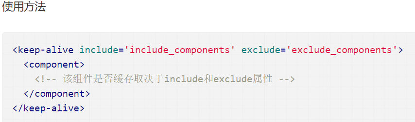
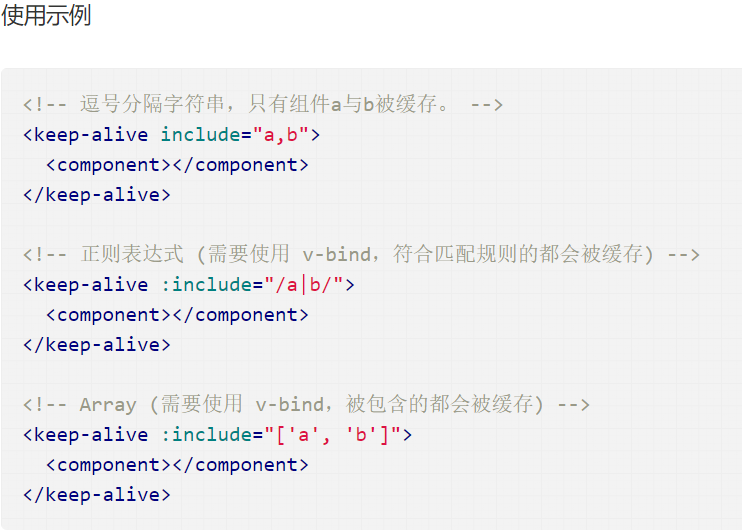
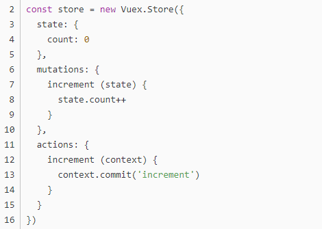

# 基础篇
1、css只在当前组件起作用
2、v-if 和 v-show 区别
3、$route和$router的区别
4、vue.js的两个核心是什么？
5、vue几种常用的指令
6、vue常用的修饰符？
7、v-on 可以绑定多个方法吗？
8、vue中 key 值的作用？
9、什么是vue的计算属性？
10、vue等单页面应用及其优缺点
11、怎么定义 vue-router 的动态路由? 怎么获取传过来的值
12、watch和computed差异
  1. watch和computed都是以Vue的依赖追踪机制为基础的，它们都试图处理这样一件事情：当某一个数据（称它为依赖数据）发生变化的时候，所有依赖这个数据的“相关”数据“自动”发生变化，也就是自动调用相关的函数去实现数据的变动。
  2. 1.watch擅长处理的场景：一个数据影响多个数据
     2.computed擅长处理的场景：一个数据受多个数据影响
  3. computed具有缓存性，页面重新渲染值不变化,计算属性会立即返回之前的计算结果，而不必再次执行函数,watch无缓存性，页面重新渲染时值不变化也会执行;
  
13、组件中data为什么是函数

# 扩展篇
14、对于MVVM的理解？
15、VUE生命周期的几个阶段
16、什么是vue生命周期？
17、vue生命周期的作用是什么？
18、第一次页面加载会触发哪几个钩子？
19、DOM 渲染在 哪个周期中就已经完成？
20、VUE实现数据双向绑定的原理
21、VUE组件间的参数传递
22、VUE的路由实现：hash模式和history模式
23、VUEX是什么？怎么使用？哪种功能场景使用它？
24、对keep-alive的理解
25、虚拟DOM的优缺点？
26、vue的watch的深度使用
27、vue与react的选择
28、vuex中mutation和action的详细区别
29、vue-router中导航守卫有哪些
30、简述vue中diff算法原理

## 1.css只在当前组件起作用
答：在style标签中写入scoped即可。例如：

2.v-if 和 v-show 区别
答：简单回复：v-if按照条件是否渲染，v-show是display的block或none；
详细比较：
v-show是css切换，v-if是完整的销毁和重新创建。
使用
频繁切换时用v-show，运行时较少改变时用v-if
v-if=‘false’ v-if是条件渲染，当false的时候不会渲染

3.$route和$router的区别
答：$route是“路由信息对象”，包括path，params，hash，query，fullPath，matched，name等路由信息参数。而$router是“路由实例”对象包括了路由的跳转方法，钩子函数等。

4.组件中data为什么是函数？
为什么组件中的 data 必须是一个函数，然后 return 一个对象，而 new Vue 实例里，data 可以直接是一个对象？
因为组件是用来复用的，JS 里对象是引用关系，这样作用域没有隔离，而 new Vue 的实例，是不会被复用的，因此不存在引用对象的问题。

5.对keep-alive的理解
keep-alive是 Vue 内置的一个组件，可以使被包含的组件保留状态，或避免重新渲染。
在vue 2.1.0 版本之后，keep-alive新加入了两个属性: include(包含的组件缓存) 与 exclude(排除的组件不缓存，优先级大于include) 。

6、vuex中mutation和action的详细区别

1）、流程顺序
“相应视图—>修改State”拆分成两部分，视图触发Action，Action再触发Mutation。
2）、触发方式
mutation的触发通过store.commit来进行action的触发通过。
3）、角色定位
基于流程顺序，二者扮演不同的角色。
Mutation：专注于修改State，理论上是修改State的唯一途径。
Action：业务代码、异步请求。
4）、限制
角色不同，二者有不同的限制。
Mutation：必须同步执行。
Action：可以异步，但不能直接操作State。

1. 始终在 v-for 中使用 :key
在需要操纵数据时，将key属性与v-for指令一起使用可以让程序保持恒定且可预测。

这是很有必要的，这样Vue就可以跟踪组件状态，并对不同的元素有一个常量引用。在使用动画或Vue转换时，key 非常有用。

如果没有key ，Vue只会尝试使DOM尽可能高效。这可能意味着v-for中的元素可能会出现乱序，或者它们的行为难以预测。如果我们对每个元素都有唯一的键引用，那么我们可以更好地预测Vue应用程序将如何精确地处理DOM操作。

图片

2. 使用驼峰式声明 props，并在模板中使用短横线命名来访问 props。
最佳做法只是遵循每种语言的约定。在 JS 中，驼峰式声明是标准，在HTML中，是短横线命名。因此，我们相应地使用它们。
幸运的是，Vue 已经提供了驼峰式声明和短横线命名之间转换，因此除了实际声明它们之外，我们不必担心任何事情。

图片

3. data 应始终返回一个函数
声明组件data时，data选项应始终返回一个函数。如果返回的是一个对象，那么该data将在组件的所有实例之间共享。
图片
但是，大多数情况下，我们的目标是构建可重用的组件，因此我们希望每个组件返回一个惟一的对象。我们通过在函数中返回数据对象来实现这一点。
图片

4. 不要在同个元素上同时使用v-if和v-for指令
为了过滤数组中的元素，我们很容易将v-if与v-for在同个元素同时使用。
图片

问题是在 Vue 优先使用v-for指令，而不是v-if指令。它循环遍历每个元素，然后检查v-if条件。
图片
这么做有几个好处：
渲染效率更高，因为我们不会遍历所有元素
仅当依赖项更改时，才会重使用过滤后的列表
这写法有助于将组件逻辑从模板中分离出来，使组件更具可读性

5. 模板表达式应该只有基本的 JS 表达式
在模板中添加尽可能多的内联功能是很自然的。但是这使得我们的模板不那么具有声明性，而且更加复杂，也让模板会变得非常混乱。

为此，让我们看看Vue样式指南中另一个规范化字符串的示例，看看它有多混乱。
图片
基本上，我们希望模板中的所有内容都直观明了。为了保持这一点，我们应该将复杂的表达式重构为适当命名的组件选项。
分离复杂表达式的另一个好处是可以重用这些值。
图片

6. 不要在“created”和“watch”中调用方法
Vue开发人员经常犯的一个错误是他们不必要地在created和watch中调用方法。其背后的想法是，我们希望在组件初始化后立即运行watch。
图片
但是，Vue为此提供了内置的解决方案，这是我们经常忘记的Vue watch属性。
我们要做的就是稍微重组watch并声明两个属性：
1）handler (newVal, oldVal)-这是我们的watch方法本身。
2）immediate: true- 代表如果在 wacth 里声明了之后，就会立即先去执行里面的handler方法，如果为 false就跟我们以前的效果一样，不会在绑定的时候就执行
图片